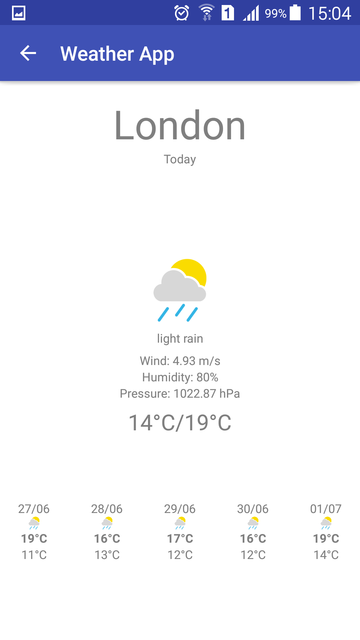

# WeatherApp

Weather App was developed in Android platform using OpenWeatherMap API (http://openweathermap.org/api).

#Libraries
The dependencies are described in the Gradle script `build.gradle` (project and app). All libraries used are described below:

1. [Butterknife](https://github.com/JakeWharton/butterknife): Field and method binding for Android views.
2. [Retrofit/OKhttp](http://square.github.io/retrofit/): Network Request (REST) and Rx integration.
3. [Jackson](https://github.com/FasterXML/jackson/wiki): Java library used to convert Java objects into JSON.
4. [Picasso](http://square.github.io/picasso/): A powerful image downloading and caching library for Android.
5. [Paper](https://github.com/pilgr/Paper): Fast and simple NoSQL data storage library for Android.
6. [RxJava/RxAndroid](http://reactivex.io/): An API for asynchronous programming with observable streams.

#Implementation

To develop Weather app, it was chosen a architecture based on MVP and Repository pattern.
There are three four main packages: model, core, data anda ui.

- Core: Keep the domain rules (which in this case are none), models and aggregations models.
- Date: Responsible for any data used in the application. Uses the Repository pattern.
- Ui: Responsible views and it is also responsible for the presentation (Presenter).

#Next steps

- Improve unit and functional tests.
- Improve arrangement between elements in views.
- Change progress visualization while waiting for response after a REST call.
- Tests to check another kind of storage (ORM library like Real, GreenDAO, OrmLite).

#Screenshots

